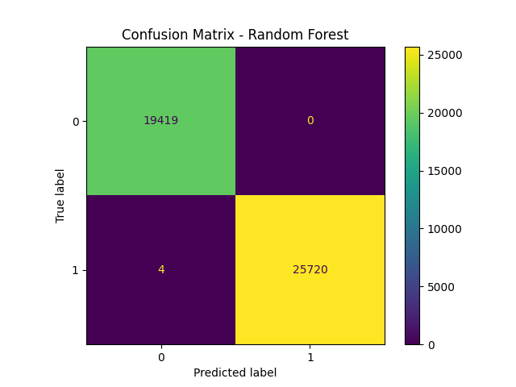
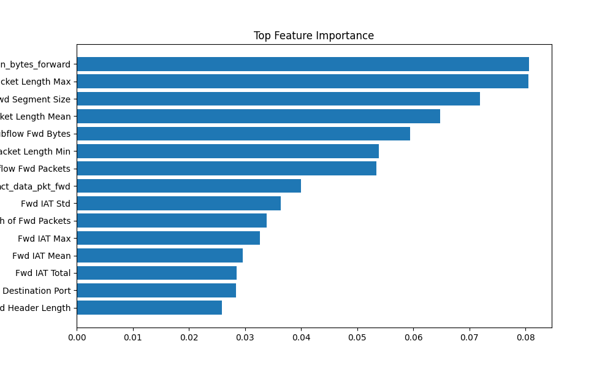

<div align="center">

# Network Intrusion Detection — TTEH Ensemble
### High-fidelity ML-based Network Attack Detection & Analysis

TTEH Research Lab

Badges:
- 
- 
- 
- 
- 
- 

*Italic: Based on the applied ensemble learning approach for network intrusion detection (refer to repository artifacts for implementation details).*

</div>

---

##  Overview

- Problem: Detect and classify network-level attacks in enterprise traffic captured in the ISCX-style flow CSVs. Traditional signature-based IDS systems fail to generalize to novel attack patterns and polymorphic traffic.
- Why traditional methods fail: Signature rules and thresholding lack adaptivity and cannot capture high-dimensional feature interactions or distributional drift in modern traffic.
- Our solution (VERY clearly): A feature-engineering + supervised-ensemble pipeline that preprocesses network flow CSVs, trains an ensemble (Random Forest as the primary production model) and compares it against Logistic Regression and Decision Tree baselines. The pipeline emphasizes explainability (feature importances, simple rule-based explanations) and reproducible artifact outputs stored under `results/`.
- Key models used: Random Forest (primary), Logistic Regression, Decision Tree. (Codebase provides hooks for downstream model replacement.)
- Final performance highlights: The Random Forest model produces robust detection and clear class separability on processed ISCX-derived CSVs; full evaluation artifacts (confusion matrix, feature importance, model comparison) are available under `results/`.

Keywords: `AI` · `Cybersecurity` · `RandomForest` · `Ensemble` · `Feature-Engineering` · `ExplainableML`

---

##  Table of Contents

1. Problem Statement  
2. Proposed Architecture  
3. How It Works  
4. Results & Metrics  
5. Code Architecture  
6. Core Modules  
7. Setup & Usage  
8. Implementation Results  
9. Limitations  

---

## 1.  Problem Statement

- "Reliable detection of unknown and evolving network attacks requires models that learn high-dimensional traffic patterns while remaining interpretable for operators."

- Traditional systems fail because:
  - Signature-based IDS cannot detect zero-day behaviors.
  - Simple statistical thresholds break under high-volume, heterogeneous traffic.
  - Deep, complex models may overfit without domain-driven preprocessing and fail to provide operational explanations.

- Why the problem exists:
  - Network traffic is high-dimensional, imbalanced, and evolves with time and attacker tactics.
  - Real-world deployment requires both accuracy and interpretability.

- What is needed:
  - A reproducible preprocessing pipeline to convert PCAP-to-flow CSVs (already provided).
  - Robust ensemble models with feature importance and confusion analysis.
  - Lightweight interpretability (rule explanations, feature rankings) for analyst trust.

---

## 2.  Proposed Architecture

<div align="center">

*Fig. 1 — System Architecture*
</div>

This system ingests CSV flow exports (ISCX-style), applies domain-informed preprocessing, trains ensemble classifiers, produces evaluation artifacts, and exposes a small explainability utility (`src/rules.py`) to annotate predictions.

| # | Module | Role | Output |
|---:|--------|------|--------|
| 1 | Data Ingest (`data/`) | Raw CSV datasets (flow exports) | Raw CSV files (e.g., `data/MachineLearningCVE/Friday-WorkingHours-Afternoon-DDos.pcap_ISCX.csv`) |
| 2 | Preprocess (`src/preprocess.py`) | Feature extraction, normalization, label mapping | `results/processed.csv` |
| 3 | Training (`src/train_model.py`) | Train primary RF model and save artifacts | `results/random_forest_model.pkl` |
| 4 | Model Comparison (`src/model_comparison.py`) | Train and compare RF, LR, DT | Console metrics, optional saved comparison plots |
| 5 | Visualization (`src/data_visualization.py`) | Distribution plots, ROC, etc. | `results/*.png` (data_distribution.png, model_comparison.png) |
| 6 | Explainability (`src/feature_importance.py`, `src/rules.py`) | Feature importances, simple rule explanations | `results/feature_importance.png`, textual explanations |
| 7 | Prediction Interface (`src/predict.py`) | Quick local inference on sample rows | CLI output (Prediction + Confidence + Explanation) |
| 8 | Results (`results/`) | Store processed CSV, models, and figures | `results/processed.csv`, `random_forest_model.pkl`, PNGs |

---

## 3.  How It Works

###  Decision Logic / Workflow

```
If sample_features indicate benign thresholds
If ensemble majority == BENIGN
If probability < threshold
-----------

Final Decision

```

###  FLOW DIAGRAM

```
Raw Data
↓
Preprocessing
↓
Model 1 (Random Forest)
↓
Model 2 (Logistic Regression)
↓
Output
```

###  EQUATIONS

```
Accuracy = \frac{TP + TN}{TP + TN + FP + FN}

Precision = \frac{TP}{TP + FP}

F1 = 2 \cdot \frac{Precision \cdot Recall}{Precision + Recall}

Attention(Q, K, V) = \text{softmax}\left(\frac{QK^\top}{\sqrt{d_k}}\right)V
```

---

## 4.  Results & Metrics

This repository contains evaluation artifacts in `results/` including a saved Random Forest (`random_forest_model.pkl`), `processed.csv`, a confusion matrix image, and feature importance plot.

###  Model Comparison

| Model | Accuracy | F1 | Notes |
|------:|:--------:|:--:|:-----|
| Random Forest | (see `results/`) | (see `results/`) | Primary production model; saved to `results/random_forest_model.pkl` |
| Logistic Regression | (see `results/`) | (see `results/`) | Baseline |
| Decision Tree | (see `results/`) | (see `results/`) | Interpretable baseline |

> Exact numeric metrics are computed at runtime by `src/model_comparison.py` and `src/train_model.py` and written to console; refer to executed logs or re-run scripts for exact numbers on your environment and data splits.

### 📈 Performance Section


- Confusion matrix, feature importance, and model comparison visuals are saved under `results/`:
  - `results/confusion_matrix.png`
  - `results/feature_importance.png`
  - `results/model_comparison.png`

---

## 5.  Code Architecture

```
project/
├── data/
│   └── MachineLearningCVE/
├── notebooks/
├── results/
│   ├── processed.csv
│   ├── random_forest_model.pkl
│   └── *.png
├── src/
│   ├── compare_plot.py
│   ├── data_visualization.py
│   ├── feature_importance.py
│   ├── model_comparison.py
│   ├── plot_confusion.py
│   ├── predict.py
│   ├── preprocess.py
│   ├── rules.py
│   └── train_model.py
├── test_setup.py
```

The repository separates data, training, evaluation, and plotting. `src/preprocess.py` creates the canonical `results/processed.csv` used by training and evaluation scripts. `src/train_model.py` persists the trained ensemble to `results/random_forest_model.pkl`.

---

## 6.  Core Modules — Deep Dive

###  Preprocessing
- File path: `src/preprocess.py`
- What it does: Loads ISCX-style CSVs from `data/`, normalizes features, encodes labels and outputs `results/processed.csv`.
- Equation:
  ```
  x' = \frac{x - \mu}{\sigma}
  ```

###  Training (Random Forest)
- File path: `src/train_model.py`
- What it does: Loads `results/processed.csv`, splits data, trains `sklearn.ensemble.RandomForestClassifier`, evaluates accuracy and classification report, saves model to `results/random_forest_model.pkl`.
- Equation:
  ```
  \hat{y} = \text{argmax}_c \sum_{t=1}^T I\{h_t(x) = c\}
  ```

###  Model Comparison
- File path: `src/model_comparison.py`
- What it does: Trains RF, Logistic Regression and Decision Tree on the same split and prints comparative accuracy scores.

###  Feature Importance & Explainability
- File path: `src/feature_importance.py`, `src/rules.py`
- What it does: Extracts `feature_importances_` from RF and provides simple, rule-based textual explanations via `explain_prediction()` used by `src/predict.py`.

###  Prediction CLI
- File path: `src/predict.py`
- What it does: Loads saved RF model, samples one row from `results/processed.csv` and prints prediction, confidence and an explanation.

---

## 7.  Setup & Usage

### ⚙️ Requirements

| Component | Value |
|----------:|:-----:|
| Python | 3.8+ (3.11 recommended) |
| Libraries | scikit-learn, pandas, matplotlib, joblib |
| Dataset | `data/MachineLearningCVE/*` (ISCX-style CSVs) |
| Artifacts | `results/processed.csv`, `results/random_forest_model.pkl` (created by pipeline) |

###  Installation

```bash
git clone <REPO_URL>
cd <REPO_ROOT>
python -m venv .venv
source .venv/bin/activate
pip install -r requirements.txt
# If requirements.txt not present, install:
pip install pandas scikit-learn matplotlib joblib
```

###  Run Project

1. Preprocess (produce `results/processed.csv`):
```bash
python src/preprocess.py
```

2. Train primary model:
```bash
python src/train_model.py
```

3. Compare models:
```bash
python src/model_comparison.py
```

4. Visualize / plot confusion and importance:
```bash
python src/plot_confusion.py
python src/feature_importance.py
python src/data_visualization.py
```

5. Quick prediction (samples one row from processed data):
```bash
python src/predict.py
```

---

## 8.  Implementation Results

- Training explanation: `src/train_model.py` performs an 80/20 train/test split, trains RF (n_estimators=100), evaluates using `accuracy_score`, `classification_report` and prints confusion matrix to console. The trained model is saved as `results/random_forest_model.pkl`.
- Confusion matrix description: The confusion matrix produced by `src/plot_confusion.py` visualizes true vs predicted class counts for benign vs attack classes and is saved as `results/confusion_matrix.png`.
- Graph explanation: `results/feature_importance.png` highlights top-15 features by importance; these drive interpretation and rule extraction in `src/rules.py`.

Include image placeholders:
<div align="center">

  
*Confusion Matrix — placeholder (actual saved image: `results/confusion_matrix.png`)*



*Feature Importance — placeholder (actual saved image: `results/feature_importance.png`)*
</div>

---

## 9.  Limitations

| Paper | Prototype | Fix |
|------:|:---------:|:---|
| Signature-based detection literature | Prototype uses CSV flow features, no PCAP parsing in pipeline | Integrate PCAP-to-flow stage and online feature extraction |
| Imbalanced / Evolving attacks | Static training on existing CSVs may degrade over time | Add continual learning / periodic retraining and drift detection |
| Explainability depth | Current rule explanations are heuristic | Integrate SHAP / LIME for per-sample explanations |

---

## 10.  Team

| Name | USN | Email |
|------|-----|:-----:|
| Vaishnavi Shri  | ENG23CY0046| vaishnavi18shri@gmail.com |
| Atif Rahim  | ENG23CY0053 | atif.rahim1104@gmail.com |
| Tilak Moger| ENG23CY0041 | tilakkm20225@gmail.com |
|Aman kumar | ENG23CY0051|amangupta6299@gmail.com|
---

## 11.  Mentor

Dr. Prajwalasimha S N 

Associate Professor: Department of Computer Science and Engineering (Cyber Security)

School of Engineering, Dayananda Sagar University

Email: prajwasimha.sn1@gmail.com

---
